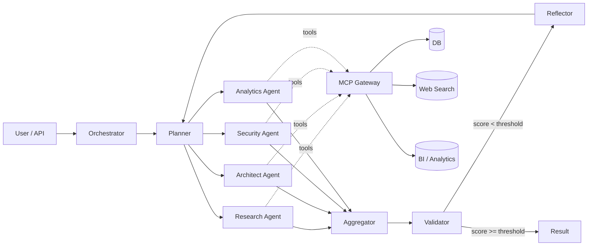

# AgentNet

**Безопасная и масштабируемая мультиагентная AI‑платформа** для корпоративного использования.
В основе — Stateful Orchestrator на базе [LangGraph](https://github.com/langchain-ai/langgraph) и набор специализированных агентов (Research, Architect, Security, Analytics …),
каждый из которых может делегировать подзадачи субагентам, работать в изолированной песочнице и обращаться к внешним инструментам через защищённый MCP Gateway.

> Этот репозиторий пока содержит **только архитектурную документацию**. Код будет добавляться модуль за модулем по мере реализации (см. [docs/ROADMAP.md](docs/ROADMAP.md)).

---

## Ключевые свойства

| Свойство | Описание |
|----------|----------|
| **Stateful workflow** | LangGraph + явная схема `state`, durable execution, контрольные точки. |
| **DAG‑планирование** | Planner Agent разбивает цель на ориентированный ациклический граф задач. |
| **Параллелизм** | Агенты исполняются параллельно, могут спавнить субагентов. |
| **Итеративность** | `plan → exec → aggregate → validate → reflect → plan`. |
| **Память и навыки** | Short‑term `state`, long‑term векторная память (RAG), reusable **skills**. |
| **MCP Gateway** | Все вызовы внешних инструментов проходят через защищённый шлюз с RBAC и аудитом. |
| **Sandbox‑изоляция** | Каждый агент в Docker / Kata / Firecracker / gVisor с ограничениями FS и сети. |
| **Human‑in‑the‑loop** | Режимы `auto-approve`, `confirm-each-step`, `block-questions`. |
| **Observability** | OpenTelemetry, Prometheus, LangSmith, структурированные логи. |
| **UI + CLI** | Веб‑дашборд для мониторинга и CLI для разработчиков. |
| **Cron / Scheduler** | Запуск задач по расписанию, ре‑верификация решений. |

---

## Структура документации

Старт — с этих файлов:

- [docs/ARCHITECTURE.md](docs/ARCHITECTURE.md) — обзор архитектуры, диаграммы, границы доверия.
- [docs/RUNTIME_WORKFLOW.md](docs/RUNTIME_WORKFLOW.md) — пошаговая логика обработки задачи.
- [docs/STATE_MODEL.md](docs/STATE_MODEL.md) — схема состояния (`state`) и правила обновления.
- [docs/SECURITY.md](docs/SECURITY.md) — модель угроз и многоуровневая изоляция.
- [docs/INFRASTRUCTURE.md](docs/INFRASTRUCTURE.md) — деплой, масштабирование, стек технологий.
- [docs/API_CONTRACTS.md](docs/API_CONTRACTS.md) — REST‑контракты модулей и примеры запросов.
- [docs/ROADMAP.md](docs/ROADMAP.md) — пошаговый план реализации.

### Описания модулей

Каждый модуль имеет собственный краткий .md (см. [docs/modules/](docs/modules/)):

| Модуль | Файл |
|--------|------|
| Orchestrator | [docs/modules/orchestrator.md](docs/modules/orchestrator.md) |
| Planner | [docs/modules/planner.md](docs/modules/planner.md) |
| Worker Agents (общее) | [docs/modules/agents.md](docs/modules/agents.md) |
| Research Agent | [docs/modules/agents-research.md](docs/modules/agents-research.md) |
| Architect Agent | [docs/modules/agents-architect.md](docs/modules/agents-architect.md) |
| Security Agent | [docs/modules/agents-security.md](docs/modules/agents-security.md) |
| Analytics Agent | [docs/modules/agents-analytics.md](docs/modules/agents-analytics.md) |
| Aggregator | [docs/modules/aggregator.md](docs/modules/aggregator.md) |
| Validator | [docs/modules/validator.md](docs/modules/validator.md) |
| Reflector | [docs/modules/reflector.md](docs/modules/reflector.md) |
| Memory | [docs/modules/memory.md](docs/modules/memory.md) |
| Skills | [docs/modules/skills.md](docs/modules/skills.md) |
| MCP Gateway | [docs/modules/mcp-gateway.md](docs/modules/mcp-gateway.md) |
| Sandbox | [docs/modules/sandbox.md](docs/modules/sandbox.md) |
| UI | [docs/modules/ui.md](docs/modules/ui.md) |
| CLI | [docs/modules/cli.md](docs/modules/cli.md) |
| Observability | [docs/modules/observability.md](docs/modules/observability.md) |
| Scheduler | [docs/modules/scheduler.md](docs/modules/scheduler.md) |

---

## Высокоуровневая схема

Подробнее — в [docs/ARCHITECTURE.md](docs/ARCHITECTURE.md).

---

## Лицензия

TBD.
