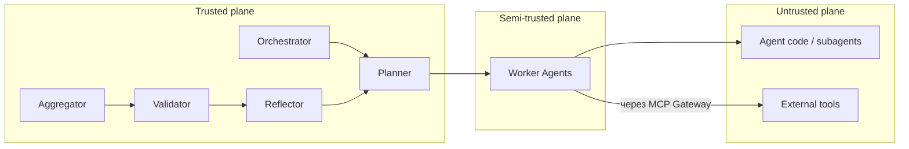

# Архитектура AgentNet

Документ описывает высокоуровневую архитектуру платформы. Подробности по каждому модулю — в [`docs/modules/`](modules/).

## Цели

1. **Безопасность.** Каждый агент потенциально недоверен: песочница, RBAC, аудит, фильтрация вызовов.
2. **Масштабируемость.** Микросервисная архитектура, горизонтальное масштабирование агентов и MCP‑инструментов.
3. **Стейтфулность.** Долговременное состояние, контрольные точки, восстановление после сбоев (LangGraph durable execution).
4. **Расширяемость.** Новый агент / навык / инструмент добавляется через конфигурацию, без изменения ядра.
5. **Прозрачность.** Полная наблюдаемость хода работы и решений — для аудита и доверия пользователя.

## Слои системы

```
┌────────────────────────────────────────────────────────────────────┐
│                        Interfaces (UI / CLI)                       │
├────────────────────────────────────────────────────────────────────┤
│                          Orchestrator API                          │
├──────────────┬───────────────┬─────────────┬───────────┬───────────┤
│  Planner     │  Aggregator   │  Validator  │ Reflector │ Scheduler │
├──────────────┴───────────────┴─────────────┴───────────┴───────────┤
│                         Worker Agents (DAG)                        │
│   Research · Architect · Security · Analytics · Custom · Subagents │
├────────────────────────────────────────────────────────────────────┤
│            Memory (short‑term / long‑term)   ·   Skills            │
├────────────────────────────────────────────────────────────────────┤
│                          MCP Gateway (RBAC)                        │
├────────────────────────────────────────────────────────────────────┤
│  External Tools / DB / RAG / BI / Web Search / Internal Services   │
├────────────────────────────────────────────────────────────────────┤
│   Sandbox runtime (Docker / Kata / Firecracker / gVisor) on K8s    │
├────────────────────────────────────────────────────────────────────┤
│    Observability (OpenTelemetry · Prometheus · LangSmith · ELK)    │
└────────────────────────────────────────────────────────────────────┘
```

## Основные модули

| # | Модуль | Назначение | Ссылка |
|---|--------|-----------|--------|
| 1 | Orchestrator | Точка входа, классификация задачи, маршрутизация по графу. | [orchestrator.md](modules/orchestrator.md) |
| 2 | Planner | Строит DAG задач из `state.idea`. | [planner.md](modules/planner.md) |
| 3 | Worker Agents | Research / Architect / Security / Analytics — выполняют шаги DAG. | [agents.md](modules/agents.md) |
| 4 | Aggregator | Объединяет выходы агентов в единый артефакт. | [aggregator.md](modules/aggregator.md) |
| 5 | Validator | Оценивает результат по метрикам, формирует `score` и `feedback`. | [validator.md](modules/validator.md) |
| 6 | Reflector | По `feedback` корректирует план, инициирует новую итерацию. | [modules/reflector.md](modules/reflector.md) |
| 7 | Memory | Short‑term `state` + long‑term векторная БД (RAG). | [memory.md](modules/memory.md) |
| 8 | Skills | Библиотека reusable шаблонов решений. | [skills.md](modules/skills.md) |
| 9 | MCP Gateway | Защищённый шлюз ко всем внешним инструментам. | [mcp-gateway.md](modules/mcp-gateway.md) |
| 10 | Sandbox | Изоляция агентов и их кода (Docker / Kata / Firecracker). | [sandbox.md](modules/sandbox.md) |
| 11 | UI | Веб‑дашборд: визуализация графа, ручное одобрение, телеметрия. | [ui.md](modules/ui.md) |
| 12 | CLI | Управление сессиями из терминала, скрипты, агентский CLI. | [cli.md](modules/cli.md) |
| 13 | Observability | Метрики, логи, трейсы, алерты. | [observability.md](modules/observability.md) |
| 14 | Scheduler | Cron‑задачи, периодическая ре‑верификация решений. | [scheduler.md](modules/scheduler.md) |

## Поток выполнения (TL;DR)

1. **Receive.** UI/CLI присылает запрос → Orchestrator открывает сессию и инициализирует `state`.
2. **Plan.** Planner строит DAG задач на основе `state.idea`.
3. **Execute.** Worker Agents (с возможностью subagent'ов) исполняют узлы DAG параллельно.
4. **Aggregate.** Aggregator сливает выходы в `state.result`.
5. **Validate.** Validator считает `score` и формирует `feedback`.
6. **Reflect / Loop.** Если `score < threshold` → Reflector корректирует план → шаг 2. Иначе → завершение.
7. **Persist.** Успешный план может быть сохранён как **skill** в [`skills`](modules/skills.md).

Полная пошаговая логика — в [RUNTIME_WORKFLOW.md](RUNTIME_WORKFLOW.md).

## Границы доверия



Каждый переход через `Gateway` — точка авторизации и аудита. См. [SECURITY.md](SECURITY.md).

## State Model (резюме)

```jsonc
{
  "idea": "string",            // исходное описание идеи
  "plan": { /* DAG */ },
  "tasks": [ /* детализация */ ],
  "research": { /* … */ },
  "architecture": { /* … */ },
  "security": { /* … */ },
  "score": 0.0,
  "iteration": 1,
  "result": "string|object",
  "feedback": "string"
}
```

Полная схема — в [STATE_MODEL.md](STATE_MODEL.md).

## Принципы

- **Single source of truth — `state`.** Любой узел читает/пишет только его.
- **Idempotent узлы.** Перезапуск шага DAG не меняет финальный `state` при тех же входах.
- **Capability‑based access.** Агент получает только токены/тулы, нужные ему для текущего шага.
- **Fail closed.** При ошибке доступа / валидации сессия переходит в `failed` с отчётом.
- **Audit‑first.** Всё логируется, любые принятые решения восстановимы.
