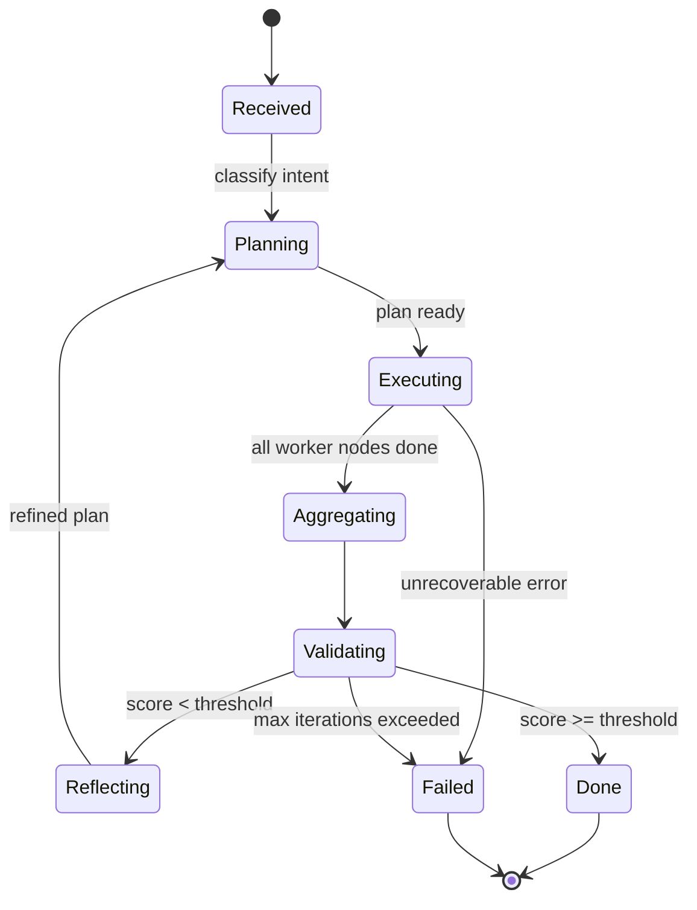

# Runtime Workflow

Документ описывает шаги обработки одной задачи от приёма запроса до финального результата.

## Жизненный цикл сессии



## Шаги

### 1. Приём и классификация

- Запрос приходит через UI или CLI:

  ```http
  POST /api/session/start
  { "task": "Проанализировать идею X" }
  ```

- Orchestrator:
  - открывает новую сессию (`session_id`),
  - классифицирует intent (анализ / дизайн / аудит / etc.),
  - инициализирует `state = {idea, iteration: 1}`,
  - выбирает режим human‑in‑the‑loop (`auto`, `confirm-each-step`, `manual`).

### 2. Планирование

- Planner Agent получает `state` и строит **DAG задач**:
  - узлы — подзадачи (`{id, agent, task, deps}`),
  - рёбра — зависимости.
- В план включаются параллельные ветки, чтобы агенты работали одновременно.
- План записывается в `state.plan` и `state.tasks`.

### 3. Параллельное выполнение

- Каждый worker (`research`, `architect`, `security`, `analytics`, custom):
  - получает свой срез `state` и описание задачи,
  - может спавнить субагентов через StateGraph subgraphs (например, Research Agent → несколько crawler‑subagents),
  - все вызовы внешних инструментов идут через MCP Gateway,
  - результат пишется в соответствующий ключ `state.<area>`.

### 4. Агрегация

- Aggregator собирает `state.research`, `state.architecture`, `state.security`, … в единый артефакт `state.result`.
- Дубли и конфликты разрешаются стратегиями (приоритет, голосование, summary).

### 5. Валидация

- Validator выполняет:
  - проверку соответствия требованиям (бизнес‑правила, схема, безопасность),
  - расчёт `score: float ∈ [0, 1]`,
  - формирование `feedback` (структурированный список проблем).
- Решение по флагу `retry`:
  - `score >= threshold` → `Done`,
  - `score <  threshold` → передача в Reflector.

### 6. Рефлексия и итерация

- Reflector:
  - анализирует `feedback`,
  - дополняет/перестраивает `state.plan` (новые задачи, веса, маршруты),
  - может сгенерировать уточняющие вопросы пользователю,
  - инкрементирует `state.iteration`.
- Управление снова уходит в Planner.

### 7. Завершение

- Если `score >= threshold` или `iteration >= max_iterations`:
  - формируется отчёт,
  - `state` сохраняется в long‑term memory,
  - успешный план может быть превращён в **skill** (см. [skills](modules/skills.md)),
  - сессия закрывается.

## Политика повторов и порогов

| Параметр | Значение по умолчанию | Где настраивается |
|----------|----------------------|-------------------|
| `max_iterations` | 3 | конфиг сессии |
| `score_threshold` | 0.8 | конфиг валидации |
| `node_retry` | 2 | per‑node |
| `node_timeout` | 60s | per‑node |
| `mcp_call_timeout` | 30s | gateway |

При превышении лимитов сессия переходит в `failed` с детальным отчётом для разработчика и пользователя.

## Обработка ошибок

| Тип ошибки | Поведение |
|------------|-----------|
| Тайм‑аут MCP‑инструмента | retry с backoff; при исчерпании — пометить узел `failed`, продолжить остальные. |
| Ошибка валидации схемы | прервать узел, дать Reflector возможность корректировать. |
| Sandbox crash | spawn нового контейнера, перезапуск узла. |
| Превышение `max_iterations` | завершить как `failed`, отдать отчёт пользователю. |
| Запрет policy на команду | вернуть feedback, требовать ручное одобрение или пересмотр плана. |

Все события пишутся в audit‑лог (см. [observability](modules/observability.md)).

## Human‑in‑the‑loop checkpoints

В каждом из этих мест workflow может остановиться и запросить решение пользователя:

1. После плана — подтверждение DAG.
2. Перед запуском «опасного» инструмента (по policy MCP Gateway).
3. После первой итерации — выбор продолжения.
4. Перед сохранением как `skill`.
5. Перед выкатыванием результата вовне (если есть write‑side эффекты).
